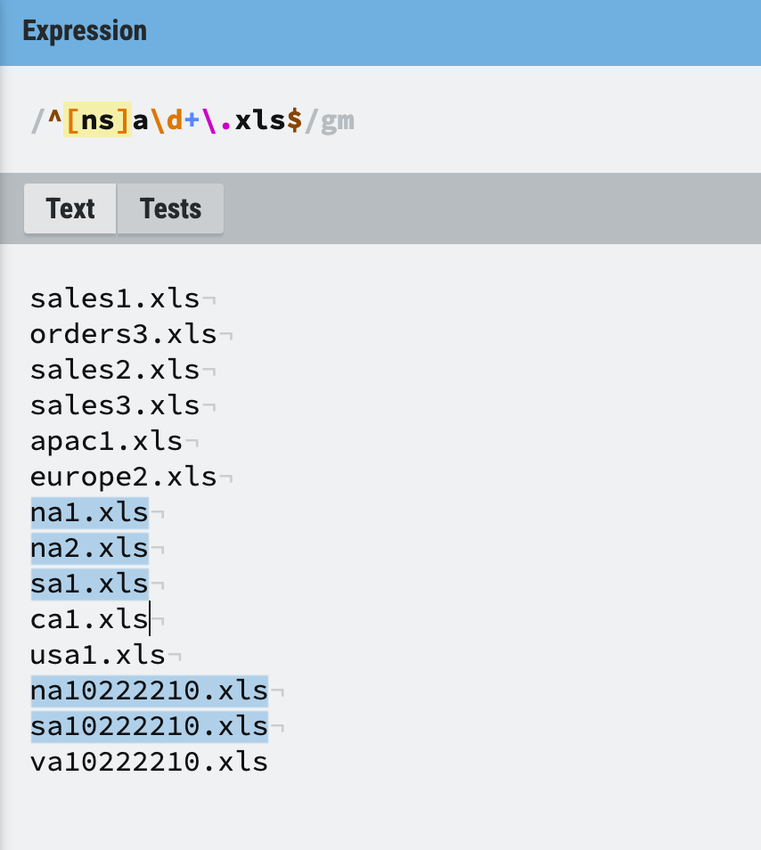

## 📚 #READING #阅读
	- {{正则表达式必知必会}}
	- [[Dec 20th, 2023]]
	- ^ 匹配开头
	- [] 字符集
	- \\d 等价于 [0-9]、[0123456789]
	- $ 匹配结尾
	- . 匹配任意一个字符
	- + 允许以之前的字符重复若干次
	- g 全局匹配
	- m多行匹配
	- 举例 \/^[ns]a.\\d+\\.xls\/gm
		- {:height 400, :width 400}
		-
		-
	-